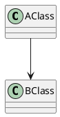

# Introduction

This template helps you create beautiful pdfs from markdown.
How you make a citation: [@einstein]

How to make Glossaries: <https://github.com/tomncooper/pandoc-gls>

Glossary: (+FOO)

Acronym first time: (+BAR)

Acronym subsequent times: (+BAR)

(look in markdown for syntax)

Singular: (+FOO)

Plural: (+^FOO)

Capital: (++FOO)

Capital plural: (++^FOO)

$5 + 5 \over 2$

```csharp
public void aMethod(){
    doSomething();
}
```


